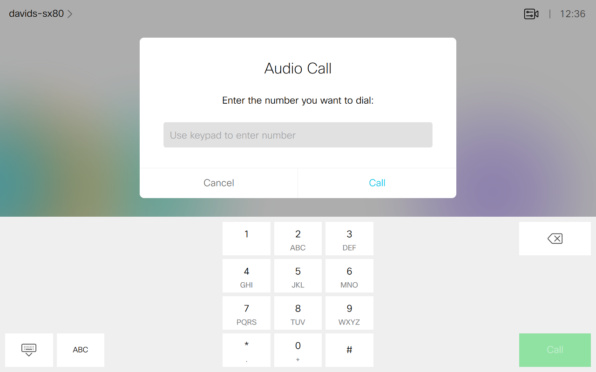

# Cisco CE Video Endpoints Macros - Audio Call
This macro and corresponding In-Room Control sample demonstrates how to create an in-room control application that adds a dedicated audio call dial pad to the Touch 10.

---
Snapshot of Touch 10 Home Screen Panel with Audio Dialler:

Snapshot of Touch 10 Home Screen Panel after pressing the Audio Dialler:

---

This sample gadget contains the following files:

     macro-samples/
	Audio Dialler/
		README.md (this file)
		audioCall.js (the macro)
		audiocall.xml (in-room control definition file)
		Touch10_AudioCall.png (sample image)
		Touch10_homescreen_AudioCall.png (sample image)
    ProvisionableApplicationPackage_AudioCall.zip (Package for provisioning)

## Requirements
1. Cisco Video room device (Room Kit devices only)
2. Firmware CE9.3.0 or newer.

## Additional Information
##### XAPI
Documentation for the XAPI can be found in the [Command References overview](https://www.cisco.com/c/en/us/support/collaboration-endpoints/telepresence-quick-set-series/products-command-reference-list.html).

## How to provision
Per codec:
  Web:
    - Log on to codec web interface with Admin Credentials
    - Navigate to 'Maintenance' - 'Backup and Restore'
    - Select 'Restore backup'
    - Select the ZIP file in this repo (Package for provisioning)
    - Press 'Upload file'
    - Voilla, check your touch panel and you should now see goodness.

  Scripting using API:
    - xCommand Provisioning Service Fetch Mode:Add URL: 'https://<YourPath>/nameofroomdeviceprovisioningfile.zip'

## Disclaimer
This example is only a sample and is **NOT guaranteed to be bug free and production quality**.

The sample macros are meant to:
- Illustrate how to use the CE Macros.
- Serve as an example of the step by step process of building a macro using JavaScript and integration with the Codec XAPI
- Provided as a guide for a developer to see how to initialize a macro and set up handlers for user and dialog updates.

The sample macros are made available to Cisco partners and customers as a convenience to help minimize the cost of Cisco Finesse customizations. Cisco does not permit the use of this library in customer deployments that do not include Cisco Video Endpoint Hardware.

## Support Notice
[Support](http://developer.cisco.com/site/devnet/support) for the macros is provided on a "best effort" basis via DevNet. Like any custom deployment, it is the responsibility of the partner and/or customer to ensure that the customization works correctly and this includes ensuring that the macro is properly integrated into 3rd party applications.

It is Cisco's intention to ensure macro compatibility across versions as much as possible and Cisco will make every effort to clearly document any differences in the XAPI across versions in the event that a backwards compatibility impacting change is made.

Cisco Systems, Inc. 
[http://www.cisco.com](http://www.cisco.com) 
[http://developer.cisco.com/site/roomdevices](http://developer.cisco.com/site/roomdevices)
